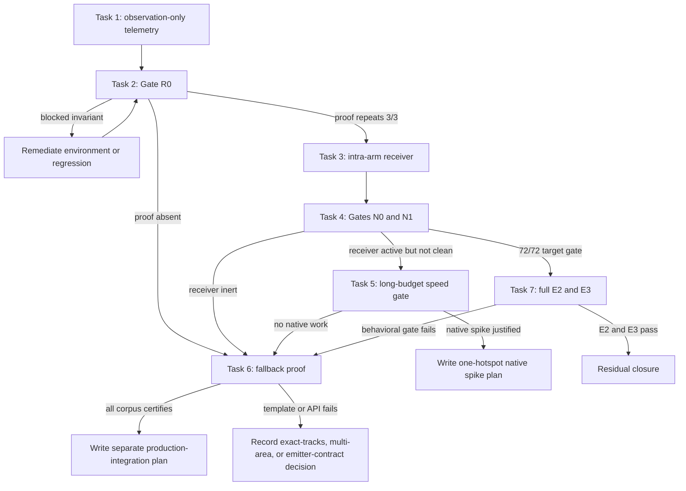

# Phase E Residual Closure Implementation Plan

> **For agentic workers:** REQUIRED SUB-SKILL: Use superpowers:subagent-driven-development (recommended) or superpowers:executing-plans to implement this plan task-by-task. Steps use checkbox (`- [ ]`) syntax for tracking.

**Goal:** Close, or decisively route around, the two remaining `universe-matrix/no-proliferator` refusals without relaxing validation, geometry, band fit, or the 30-second production budget.

**Architecture:** A measured branch, not another tuning loop. First add observation-only lifecycle telemetry for the `ClusterRelationNoGood` proofs the sequence-pair router already produces. A three-run gate decides whether the specified intra-arm receiver has reusable evidence. Implement that receiver only when the evidence exists, then gate it on the two residual cells. If it does not close them, execute the already-specified deterministic feasibility-fallback proof as a separate constructor; do not mix fallback logic into ALNS. Native/Cython work is excluded unless a new search mechanism first proves a clean larger-budget witness and passes the materiality gate in Task 5.

**Tech Stack:** Python 3.14, ortools CP-SAT 9.15, existing Cython kernels (`_sequence_kernel`, `_route_kernel`), pytest (serial), Ruff, strict MyPy, `uv run`.

**Spec:** `docs/superpowers/specs/2026-09-03-phase-e-universe-matrix-closure-design.md` §5.6 and `docs/superpowers/specs/2026-09-01-zero-refusal-reliability-design.md` §Deterministic feasibility fallback.

**Evidence baseline:** `docs/superpowers/evidence/2026-09-03-phase-e-universe-matrix/gate-e2.md` — three rounds at 70/72 CLEAN, INVALID 0, CRASH 0; only `universe-matrix/no-proliferator` refuses under freeform and sequence-pair.

## Global Constraints

- **Preserve acceptance authority.** `finalize.finalize_placement`, detailed routing, power completion, and `validate.certify` remain the only path to a returned `Placement`. No task suppresses a refusal, loosens a geometry check, enlarges a legal band, or treats a proxy/global route as success.
- **No warm-start task.** Both residual strategies refuse, and `strategy_race.IncumbentMessage` carries only `(area, belt_tiles)`, not reusable geometry. Adding a placement transport is broader than the measured problem and is not the next lever.
- **No native-speed task now.** The active route, A*, relaxed-global, and sequence decode/score kernels are already compiled. Freeform exhausts a finite six-candidate frontier before 30 seconds; sequence-pair's 300-second witness routes but exceeds the legal band. Throughput does not repair either search defect. Task 5 defines the only gate that may reopen native work.
- **LSP first.** Before changing an exported or callback symbol, run LSP references. The current TypeScript-language-server bridge has intermittently failed Python references with `this._token.cancel is not a function`; if that exact failure recurs, use `xd://ast_grep` on the narrow module and record the fallback in the task evidence. Grep is reserved for quoted monkeypatch names and user-visible strings.
- **TDD.** Every behavioral task adds the named failing tests first, runs only those tests to observe the intended failure, then implements the smallest change that passes them.
- **Serial test execution.** Never use `pytest-xdist`; CP-SAT already uses parallel workers internally.
- **Shared-file ownership.** Only one Phase E implementer edits `src/flab2bp/layout/sequence_solver.py` or `tests/layout/test_sequence_solver.py` at a time. Evidence-only work may run concurrently because it owns only files under `docs/superpowers/evidence/2026-09-04-phase-e-residual-closure/`.
- **Parallel boundary.** Belts-and-Pilers work continues in its existing `multibelt` worktree while this plan runs in a new Phase E worktree. Inside Phase E, Tasks 1→2→3→4 are evidence-dependent and stay serial. Task 6 starts only after Task 4's fallback decision; speculative parallel fallback implementation is prohibited.
- **Clean cutover.** If the receiver ships, there is one retained relation collection and one application path. Do not leave observation-only and active ledgers, compatibility aliases, or duplicated counters.
- **Measured commands.** Before each timed audit, record `uptime` and `vmstat 1 3`. Delete each JSONL target before `scripts/audit.py`, which appends.
- **Evidence directory:** `docs/superpowers/evidence/2026-09-04-phase-e-residual-closure/`.
- **Commit discipline:** explicit paths only; imperative sentence-case subject; no blanket adds, stashes, resets, or unrelated cleanup.

---

### Task 1: Add observation-only relation-proof lifecycle telemetry

**Files:**
- Modify: `src/flab2bp/layout/sequence_solver.py`
- Modify: `tests/layout/test_sequence_solver.py`

**Interfaces:**

Add these private sequence-solver types; they are not exported and do not alter `SequencePairLayout.lay_out`:

```python
type _ClusterRelationKey = tuple[
    int,                              # height
    tuple[tuple[int, int], ...],      # selected outline
    tuple[int, ...],                  # strip indices
    tuple[tuple[int, int], ...],      # relative offsets
]

@dataclass(slots=True)
class _RelationNoGoodLedger:
    proofs: dict[_ClusterRelationKey, ClusterRelationNoGood] = field(default_factory=dict)
    restart_seeds: dict[_ClusterRelationKey, set[int]] = field(default_factory=dict)
    order: list[_ClusterRelationKey] = field(default_factory=list)

    def observe(self, no_good: ClusterRelationNoGood, *, base_seed: int) -> bool:
        """Record one primary-stage proof; return whether another restart proved the same relation."""
```

The structural key deliberately excludes `evidence`: different evidence text for the same scoped relative placement is corroboration, not a different relation. It includes `height`, `outline`, `strips`, and `deltas`, so proof reuse cannot cross geometry scope.

Add observation-only fields to `_ProductionTelemetry` and publish them from both `_refusal_stats` and `_with_observational_stats`:

```python
relation_no_goods_produced: int = 0
relation_no_goods_unique: int = 0
relation_no_goods_repeated: int = 0
```

Also publish the already-maintained `best_stranded` and `best_overflow` values. Use `-1.0` only when the corresponding telemetry field is `None`. Refused sequence rows additionally publish `route_backend=route_kernel.selected_backend()` and derive `accelerator` from `run.solver._stage_stats` with the same `mixed` / single-backend / `python` rule used by `_with_observational_stats`.

Definitions:
- `produced`: primary-stage calls where `last_mile.relation_no_good(...)` returns a proof;
- `unique`: first structural key in this production run;
- `repeated`: first time each structural key is proved by a second distinct `AnnealState.base_seed`;
- sibling transform calls (`select_feedback_variant=False`) never increment counters.

No retained proof may be consulted to change a candidate in this task. Gate R0 must measure the existing search, not a partially enabled receiver.

- [ ] **Step 1: Resolve the callback and stats call sites**

Run LSP references for `StageBoundaryTransform`, `_ProductionTelemetry`, `_refusal_stats`, and `_with_observational_stats`. If Python references fail with the known cancellation defect, use AST queries scoped to `src/flab2bp/layout/sequence_solver.py` for `self.stage_boundary_transform(...)`, `_ProductionTelemetry(...)`, and the two stats functions. Search quoted monkeypatch targets in `tests/layout/test_sequence_solver.py` before changing a callable signature; this task should not need one.

- [ ] **Step 2: Write failing ledger and stats tests**

Add five tests named:

- `test_relation_no_good_ledger_counts_cross_restart_repetition_once`
- `test_relation_no_good_ledger_keeps_height_outline_strips_and_deltas_scoped`
- `test_relation_no_good_observation_ignores_sibling_transform_calls`
- `test_refusal_stats_publish_relation_no_good_observations`
- `test_clean_stats_publish_relation_no_good_observations`

The first test observes the same structural relation with evidence `("first",)` under seeds 11, 11, 22, and 33. Expected: produced 4 at the telemetry integration layer, unique 1, repeated 1. The scope test changes each key component independently and expects a distinct key. The sibling test invokes the existing stage-boundary callback once as primary and once as sibling for the same detailed result and expects produced 1.

Run:

```bash
uv run pytest -q \
  tests/layout/test_sequence_solver.py::test_relation_no_good_ledger_counts_cross_restart_repetition_once \
  tests/layout/test_sequence_solver.py::test_relation_no_good_ledger_keeps_height_outline_strips_and_deltas_scoped \
  tests/layout/test_sequence_solver.py::test_relation_no_good_observation_ignores_sibling_transform_calls \
  tests/layout/test_sequence_solver.py::test_refusal_stats_publish_relation_no_good_observations \
  tests/layout/test_sequence_solver.py::test_clean_stats_publish_relation_no_good_observations
```

Expected before implementation: import/name or missing-key failures, not an unrelated fixture failure.

- [ ] **Step 3: Implement observation only**

Create one `_RelationNoGoodLedger` in `_production_run`. In `transform_stage`, after `last_mile.relation_no_good(...)` returns non-`None`, call `observe` only when `select_feedback_variant` is true and update the three telemetry counters. Keep the existing immediate `_projection_feedback_stage_update` path unchanged.

- [ ] **Step 4: Verify and commit**

```bash
uv run pytest -q tests/layout/test_sequence_solver.py
uv run ruff check src/flab2bp/layout/sequence_solver.py tests/layout/test_sequence_solver.py
uv run mypy
```

Expected: sequence-solver tests pass, Ruff clean, and no new MyPy diagnostic relative to the repository baseline.

Commit only the two files:

```bash
git add src/flab2bp/layout/sequence_solver.py tests/layout/test_sequence_solver.py
git commit -m "feat: measure reusable sequence relation proofs"
```

---

### Task 2: Gate R0 — prove whether an intra-arm receiver is executable

**Files:**
- Create: `docs/superpowers/evidence/2026-09-04-phase-e-residual-closure/r0-sequence-round{1,2,3}.jsonl`
- Create: `docs/superpowers/evidence/2026-09-04-phase-e-residual-closure/gate-r0.md`
- Create: `docs/superpowers/evidence/2026-09-04-phase-e-residual-closure/r0-load.txt`

**Interfaces:** Consumes the three Task 1 stats keys. Produces a PASS/SKIP decision used by Task 3.

- [ ] **Step 1: Build the existing native extensions and record backend provenance**

```bash
uv sync
uv run python setup.py build_ext --inplace
uv run python - <<'PY'
from flab2bp.layout import route_kernel, sequence_kernel
print("route_selected", route_kernel.selected_backend())
print("route_compiled_available", route_kernel.compiled_available())
print("sequence_compiled_available", sequence_kernel.compiled_backend_available())
PY
```

Expected: `route_selected cython` and both availability checks true. Availability alone is insufficient for sequence-pair because backend selection is per problem; Step 3 also requires the target audit row's `stats.accelerator` to be `cython`.

- [ ] **Step 2: Run three deterministic target rounds**

`scripts/audit.py` filters by URL, not spec label, so each command runs the three `universe-matrix` specs; gate extraction selects `no-proliferator`.

```bash
set -e
D=docs/superpowers/evidence/2026-09-04-phase-e-residual-closure
mkdir -p "$D"
: > "$D/r0-load.txt"
for R in 1 2 3; do
  JSON="$D/r0-sequence-round$R.jsonl"
  rm -f "$JSON"
  { echo "== round $R"; uptime; vmstat 1 3; } >> "$D/r0-load.txt"
  set +e
  uv run python scripts/audit.py --budget 30 --jobs 3 --max-seconds 180 \
    --only universe-matrix --strategy sequence-pair --json "$JSON"
  RC=$?
  set -e
  test "$RC" -eq 0 -o "$RC" -eq 1
  test "$(wc -l < "$JSON")" -eq 3
done
```

- [ ] **Step 3: Extract and judge R0**

For each `no-proliferator` row, print status, seconds, stages, `best_stranded`, `best_overflow`, `route_backend`, `accelerator`, and the three relation counters. Also print INVALID and CRASH counts over all nine rows.

R0 **PASS** requires, in every target round:
- `relation_no_goods_produced >= 1`;
- `relation_no_goods_unique >= 1`;
- `relation_no_goods_repeated >= 1`;
- `stats.route_backend == \"cython\"` and `stats.accelerator == \"cython\"`;
- `stages >= 4` unless the row is CLEAN;
- no INVALID or CRASH row anywhere in the nine rows.

R0 **SKIP** if every backend/stage/validity check passes but any target round has zero produced or zero repeated proofs. That makes the proposed receiver inert under the production schedule. Record the measurements, skip Tasks 3 and 4, and continue at Task 6. Do not tune a timeout, seed, or counter threshold to manufacture PASS.

R0 **BLOCKED** if a target row did not use both compiled backends, a non-CLEAN row has fewer than four stages, or any row is INVALID/CRASH. Backend failures are repaired as environment problems; stage or validity failures are investigated as regressions with a focused reproduction. Rerun R0 after remediation. Do not advance to Task 3 or Task 6 from a BLOCKED result.

- [ ] **Step 4: Write and commit the evidence**

`gate-r0.md` contains the branch-point hash, command, backend provenance, the three extracted rows, and one final line exactly `R0: PASS — receiver evidence exists`, `R0: SKIP — receiver evidence absent`, or `R0: BLOCKED — <exact failed invariant>`.

```bash
git add docs/superpowers/evidence/2026-09-04-phase-e-residual-closure
git commit -m "bench: record sequence relation proof gate"
```

---

### Task 3: Implement the intra-arm relation no-good receiver

**Precondition:** Task 2 ended `R0: PASS`. `R0: SKIP` bypasses this task and continues at Task 6. `R0: BLOCKED` remediates and reruns Task 2; it advances nowhere.

**Files:**
- Modify: `src/flab2bp/layout/sequence_solver.py`
- Modify: `tests/layout/test_sequence_solver.py`

**Interfaces:** Extend `_RelationNoGoodLedger` with deterministic matching and one-state attempt tracking. Add active counters:

```python
relation_no_goods_matched: int = 0
relation_no_goods_applied: int = 0
relation_no_goods_scope_skipped: int = 0
```

`matched` means a proof from a different restart seed structurally matches the current decoded pack through `_projection_feedback_matches`. `applied` means `_projection_feedback_stage_update(..., try_relation_update=True)` returned a state different from the input. `scope_skipped` counts retained proofs rejected by height, outline, strip range, or relative deltas; it is diagnostic only.

- [ ] **Step 1: Write failing receiver tests**

Add eight tests named:

- `test_relation_receiver_retains_restart_zero_proof_for_restart_one`
- `test_relation_receiver_never_reuses_same_restart_proof`
- `test_relation_receiver_rejects_height_outline_variant_and_delta_mismatches`
- `test_relation_receiver_budget_expiry_does_not_apply_or_consume_proof`
- `test_relation_receiver_deduplicates_changed_evidence_text`
- `test_relation_receiver_uses_first_proved_matching_relation_deterministically`
- `test_relation_receiver_attempts_one_state_only_once`
- `test_relation_receiver_updates_before_the_next_detailed_route`

Use the existing `ClusterRelationNoGood`, `AnnealState`, `_decoded_pack`, `_projection_feedback_matches`, and `_projection_feedback_stage_update` helpers. The integrated test supplies a proof on restart seed 11, presents the same relation on seed 22, and asserts the next prepared candidate has a changed positive or negative pair before its detailed-route adapter is called.

Run the eight tests. Expected before implementation: missing receiver methods/counters or unchanged pair assertions.

- [ ] **Step 2: Implement retained matching**

Keep insertion order in `_RelationNoGoodLedger.order`. For a candidate state:

1. Ignore keys never proved under a different `base_seed`.
2. Iterate oldest structural keys first.
3. Use `_projection_feedback_matches`; do not reimplement its height/outline/delta checks.
4. Identify an attempt by `(structural_key, state.base_seed, state.pair, state.gaps, state.variant_indices)`. Attempt each tuple at most once.
5. Call `_projection_feedback_stage_update` with `try_relation_update=True` and the current deadline.
6. Return the first changed `StageBoundaryUpdate`; apply at most one retained relation per boundary.
7. If the deadline is exhausted or no pair swap escapes the proof, keep the proof available for a different state.

In `_production_run.transform_stage`, consult retained proofs before deriving or immediately applying the current detailed result's new proof. This changes the next candidate, never the already-routed candidate. The existing immediate feedback path remains the fallback when no retained proof applies.

Publish the three active counters in refusal and clean stats beside Task 1's counters.

- [ ] **Step 3: Verify determinism and authority**

```bash
uv run pytest -q tests/layout/test_sequence_solver.py
uv run pytest -q tests/layout/test_last_mile.py tests/layout/test_validate.py
uv run ruff check src/flab2bp/layout/sequence_solver.py tests/layout/test_sequence_solver.py
uv run mypy
```

The receiver may change search order; it may not make validator, finalizer, or detailed-route tests accept a previously invalid placement.

- [ ] **Step 4: Commit**

```bash
git add src/flab2bp/layout/sequence_solver.py tests/layout/test_sequence_solver.py
git commit -m "feat: reuse sequence relation proofs across restarts"
```

---

### Task 4: Gates N0 and N1 — prove receiver mechanics, then residual closure

**Precondition:** Task 3 shipped.

**Files:**
- Create: `docs/superpowers/evidence/2026-09-04-phase-e-residual-closure/n0-sequence-round{1,2,3}.jsonl`
- Create: `docs/superpowers/evidence/2026-09-04-phase-e-residual-closure/n1-both-round{1,2,3}.jsonl`
- Create: `docs/superpowers/evidence/2026-09-04-phase-e-residual-closure/gate-n0.md`
- Create: `docs/superpowers/evidence/2026-09-04-phase-e-residual-closure/gate-n1.md`

- [ ] **Step 1: Run Gate N0**

Repeat Task 2's three sequence-pair `universe-matrix` commands into the `n0-*` files.

N0 mechanics **PASS** requires every `no-proliferator` row to have:
- produced, unique, repeated, matched, and applied counters all at least 1;
- `stages >= 4` unless CLEAN;
- INVALID 0 and CRASH 0.

If any proof counter stays zero, the receiver is inert or unreliable. Revert the Task 3 behavior commit, retain Task 1 telemetry and the evidence commit, and continue at Task 6. Do not widen receiver scope.

- [ ] **Step 2: Run Gate N1 when N0 passes**

```bash
set -e
D=docs/superpowers/evidence/2026-09-04-phase-e-residual-closure
for R in 1 2 3; do
  JSON="$D/n1-both-round$R.jsonl"
  rm -f "$JSON"
  { echo "== N1 round $R"; uptime; vmstat 1 3; } >> "$D/n1-load.txt"
  set +e
  uv run python scripts/audit.py --budget 30 --jobs 6 --max-seconds 180 \
    --only universe-matrix --strategy both --json "$JSON"
  RC=$?
  set -e
  test "$RC" -eq 0 -o "$RC" -eq 1
  test "$(wc -l < "$JSON")" -eq 6
done
```

N1 closure **PASS** requires `universe-matrix/no-proliferator` CLEAN under both strategies in all three rounds, INVALID 0, CRASH 0, and no regression in the other four rows relative to Gate E2. A one-off CLEAN is not closure.

- [ ] **Step 3: Make the branch decision**

- **N1 PASS:** keep the receiver; skip Task 6; execute Task 7.
- **N1 FAIL with receiver counters moving:** keep the receiver evidence but do not claim closure. Execute Task 5's long-budget efficacy control, then Task 6.
- **N1 FAIL with counters not moving:** revert the receiver behavior as specified in Step 1 and execute Task 6.

Record exact statuses, counters, seconds, minimum stranded count, and final extent/band result. Commit evidence only after the verdict is explicit.

---

### Task 5: Conditional speed-materiality gate

**Purpose:** Decide whether a new search mechanism has made a native optimization spike worth designing. This task authorizes measurement only; it does not authorize Cython work.

**Files:**
- Create only when N1 fails with active receiver counters: `docs/superpowers/evidence/2026-09-04-phase-e-residual-closure/s0-long-budget.md`
- Create: `docs/superpowers/evidence/2026-09-04-phase-e-residual-closure/s0-sequence-round{1,2,3}.jsonl`
- Create matching 30-second profile artifacts only when all three 120-second rows are CLEAN.

- [ ] **Step 1: Run the efficacy control**

Run the changed sequence-pair `universe-matrix` target at 120 seconds for three rounds. Compare each row's `best_stranded` against the corresponding R0 row, not historical Gate E2, because Task 1 first makes that metric available. Do not run another 300-second probe: the existing 300-second evidence already produced a fully routed but illegal-band extent and does not make speed relevant.

- [ ] **Step 2: Apply the speed gate**

If any 120-second target row is not CLEAN, end `s0-long-budget.md` with `S0: NO NATIVE WORK` and continue at Task 6. A lower stranded count without a legal finalized placement is search evidence, not a speed mandate.

If all three are CLEAN, profile the unchanged 30-second target three times. End with `S0: NATIVE SPIKE JUSTIFIED` only when one specific Python hotspot is at least 20% of median target-cell wall and at least 5 seconds exclusive in two of three profiles, and Amdahl's law shows eliminating that hotspot could bring the observed time-to-CLEAN inside 30 seconds. Name the exact function and measured exclusive share. Otherwise end `S0: NO NATIVE WORK` and continue at Task 6.

`S0: NATIVE SPIKE JUSTIFIED` is an architecture-decision terminal for this plan: write a separate reviewed implementation plan for that one hotspot. That later plan must require at least 2× fixed-work substage speedup, at least 15% median whole-cell speedup, unchanged candidate/evidence/final digests for a pure optimization, at least 25% more distinct routed candidates or stages at fixed 30 seconds, and CLEAN 3/3 at the production budget. For an A* heuristic it must additionally require at least 30% fewer expansions with the same pack/digest and no new failure.

---

### Task 6: Prove the deterministic feasibility fallback template

**Precondition:** R0 skipped, N0 failed, N1 failed, S0 ended `NO NATIVE WORK`, or Task 7 failed E2/E3 behavior. This is the reliability spec's required design spike. It is not production integration.

**Files:**
- Create: `src/flab2bp/layout/feasibility_fallback.py`
- Create: `tests/layout/test_feasibility_fallback.py`
- Create: `scripts/prove_feasibility_fallback.py`
- Create: `tests/scripts/test_prove_feasibility_fallback.py`
- Create: `docs/superpowers/evidence/2026-09-04-phase-e-residual-closure/fallback-proof.jsonl`
- Create: `docs/superpowers/evidence/2026-09-04-phase-e-residual-closure/gate-f0.md`

**Interfaces:** The proof module is private to the spike and has no call from `pipeline.build`, freeform, sequence-pair, CLI, or web code.

```python
@dataclass(frozen=True, slots=True)
class CanonicalFallbackPlan:
    selected_strips: tuple[Strip, ...]
    origins: tuple[tuple[int, int], ...]
    outline_width: int
    outline_height: int
    trunk_columns: tuple[int, ...]
    net_tracks: tuple[tuple[LogicalNetId, int, int], ...]  # net, track, level

@dataclass(frozen=True, slots=True)
class CanonicalFallbackProof:
    plan: CanonicalFallbackPlan | None
    placement: Placement | None
    reason: str

def prove_canonical_fallback(
    spec: BuildSpec,
    *,
    band_policy: BandPolicy,
    power: bool,
    cancelled: Callable[[], bool] | None = None,
) -> CanonicalFallbackProof:
    """Construct, emit, finalize, and validate one canonical feasibility layout."""
```

Algorithmic invariants from the reliability spec:
1. create `envelope = finalize.band_policy_search_envelope(band_policy, perimeter=_ENTRY_RING)`;
2. reject with a specific reason if `envelope.boundary_core_height` is `None`; otherwise use that height and compute its widest legal core width with `finalize.band_target_width(envelope, height=height, width=finalize.C_BAND_SCAN_MAX)`, then require `envelope.frame_candidates(width, height)` to be non-empty;
3. use `plan_strips` and a single canonical sort key based on stable strip instance identity;
4. reserve trunk columns and crossing rows before placing any strip;
5. assign every logical net a deterministic `(track, level)` before detailed belt emission;
6. emit through existing routing/emission primitives, complete power, call `finalize.finalize_placement`, then require `validate.certify(finalized, spec, expect_power=power).ok`;
7. return `placement=None` with a specific reason on any fit, routing, power, finalization, cancellation, or certification failure;
8. never call ALNS, sequence annealing, operator selection, or the freeform candidate sweep.

- [ ] **Step 1: Write failing pure-constructor tests**

Cover canonical strip order, pre-reserved non-overlapping corridors, deterministic track/level assignment, cancellation, no fit outside a real band, and identical plan digest across repeated runs.

- [ ] **Step 2: Write failing authority tests**

Inject failures from detailed emission, power completion, finalization, and validation. Each must return no placement and preserve the exact reason. A proxy fit is never a successful proof.

- [ ] **Step 3: Implement the minimum complete constructor**

Implement the stated template without wiring production callers. Reuse existing strip planning, route emission, power, finalizer, and validator functions; do not copy them into the new module. Run LSP references before exposing any new parameter on an existing helper.

If an existing emitter cannot consume predetermined tracks/levels, stop the implementation branch with `F0: TEMPLATE API GAP`. Delete the newly created unimplemented production module and its red tests before committing. Commit evidence only: name the exact existing emitter signature, the missing track/level input contract, and the smallest interface change a later design must specify. No red test or placeholder module may remain.

- [ ] **Step 4: Prove the supported corpus**

When no API gap exists, `prove_feasibility_fallback.py` iterates the same supported stress-tier corpus and candidate policies as `scripts/audit.py`, with one row per spec/policy. Each row records plan digest, band, extent, emitted status, finalization status, validation status, and reason.

Gate F0 **PASS** requires every supported feasible corpus spec to produce a legal, validator-clean `Placement`; no INVALID, CRASH, or unrun rows. If any spec fails:
- do not wire the fallback into production;
- classify the failure as corridor-template capacity, track assignment, emitter API, multi-area requirement, or model infeasibility;
- end `gate-f0.md` with `F0: STRONGER EXACT TRACK ASSIGNMENT REQUIRED`, `F0: MULTIPLE BLUEPRINT AREAS REQUIRED`, or `F0: TEMPLATE API GAP` as the evidence dictates.

- [ ] **Step 5: Verify and commit the spike**

```bash
uv run pytest -q tests/layout/test_feasibility_fallback.py tests/scripts/test_prove_feasibility_fallback.py
uv run ruff check src/flab2bp/layout/feasibility_fallback.py scripts/prove_feasibility_fallback.py \
  tests/layout/test_feasibility_fallback.py tests/scripts/test_prove_feasibility_fallback.py
uv run mypy
```

Commit the spike and its evidence only. Production integration requires F0 PASS and a separate reviewed task because this plan deliberately prevents a partial fallback from shipping.

---

### Task 7: Full closure verification and Phase E outcome

**Precondition:** N1 passed. If Task 6 ran instead, Phase E ends with its F0 design verdict and does not claim 72/72.

**Files:**
- Create: `docs/superpowers/evidence/2026-09-04-phase-e-residual-closure/e2-round{1,2,3}.jsonl`
- Create: `docs/superpowers/evidence/2026-09-04-phase-e-residual-closure/gate-e2-amendment.md`
- Create: `docs/superpowers/evidence/2026-09-04-phase-e-residual-closure/e3-{freeform,sequence-pair}-rep{1..10}.jsonl`
- Create: `docs/superpowers/evidence/2026-09-04-phase-e-residual-closure/gate-e3.md`
- Modify: `docs/superpowers/specs/2026-09-03-phase-e-universe-matrix-closure-design.md`
- Modify: `docs/superpowers/specs/2026-09-02-phase-c-alns-window-repair-design.md`

- [ ] **Step 1: Run the full 72-cell Gate E2 amendment**

```bash
set -euo pipefail
D=docs/superpowers/evidence/2026-09-04-phase-e-residual-closure
BASE=docs/superpowers/evidence/2026-09-03-phase-e-universe-matrix
for R in 1 2 3; do
  JSON="$D/e2-round$R.jsonl"
  rm -f "$JSON"
  { echo "== E2 amendment round $R"; uptime; vmstat 1 3; } >> "$D/e2-load.txt"
  uv run python scripts/audit.py --budget 30 --jobs 16 --strategy both --json "$JSON"
  test "$(wc -l < "$JSON")" -eq 72
  uv run python scripts/audit_compare.py \
    "$BASE/e1-cand-round$R.jsonl" "$JSON" \
    --noise-area 0.013 --p95-seconds 31 --expect-cells 72 --regressions-only \
    --require-clean freeform/universe-matrix/no-proliferator \
    --require-clean sequence-pair/universe-matrix/no-proliferator
done
```

Carry all four authoritative Gate E2 clauses into `gate-e2-amendment.md`:
1. 72/72 CLEAN in every round; both residual cells CLEAN.
2. INVALID 0, CRASH 0, NOT RUN 0, no regression, area ratio within 0.013, p95 at most 31 seconds, max at most 35 seconds.
3. Every sequence-pair `universe-matrix` row has `repair:local-exact-pack >= 1`, `destroy:failed-endpoints >= 1`, `alns_window_solves >= 1`, and `stages` at least 75% of the corresponding Gate E1 row.
4. Every freeform `no-proliferator` row has `distinct_assignments >= 2` and is CLEAN; the forbidden `PACKER defect` refusal wording is absent.

Also require relation telemetry consistency: `unique <= produced`, `repeated <= unique`, `applied <= matched`.

If any E2 clause fails, first classify it. A testable counter/reporting defect is fixed with a failing regression test and the full Task 7 gate rerun. A validity, coverage, latency, area, stage-floor, operator/window, or search-behavior failure means the receiver is not shippable: revert Task 3's behavior commit, retain Task 1 telemetry and all evidence, and execute Task 6. Never narrow or waive an E2 clause.

- [ ] **Step 2: Run the full specified Gate E3 corpus**

```bash
set -euo pipefail
D=docs/superpowers/evidence/2026-09-04-phase-e-residual-closure
for S in freeform sequence-pair; do
  for REP in $(seq 1 10); do
    JSON="$D/e3-$S-rep$REP.jsonl"
    rm -f "$JSON"
    { echo "== E3 $S rep $REP"; uptime; vmstat 1 3; } >> "$D/e3-load.txt"
    uv run python scripts/audit.py --budget 30 --jobs 16 --strategy "$S" --json "$JSON"
    test "$(wc -l < "$JSON")" -eq 36
  done
done
uv run python - <<'PY'
import json
from pathlib import Path

d = Path("docs/superpowers/evidence/2026-09-04-phase-e-residual-closure")
for strategy in ("freeform", "sequence-pair"):
    counts = []
    for repetition in range(1, 11):
        path = d / f"e3-{strategy}-rep{repetition}.jsonl"
        rows = [json.loads(line) for line in path.open()]
        assert len(rows) == 36
        counts.append(sum(row["status"] == "CLEAN" for row in rows))
    print(strategy, counts, "PASS" if all(count == 36 for count in counts) else "FAIL")
PY
```

Expected exactly ten 36-cell files per strategy and `36/36` CLEAN in every file. Gate E3 has no additional area/digest tolerance.

If any E3 repetition is not 36/36, reproduce the named strategy/cell once. Fix a deterministic code defect with a failing test and rerun all of Task 7. If the non-CLEAN result reproduces without a discrete code defect, revert Task 3's behavior commit, retain telemetry/evidence, and execute Task 6. Do not average an unstable run into a pass.

- [ ] **Step 3: Run repository verification**

Use context-mode for the potentially large outputs:

```bash
uv run pytest -q
uv run ruff check .
uv run mypy
```

Then run the actual CLI for both strategies on `universe-matrix/no-proliferator` at budget 30 and verify each exits successfully with a non-empty blueprint string.

- [ ] **Step 4: Independent reviews**

Request one code review against this plan and one verification/evidence review against Gates R0, N0, N1, E2, and E3. Fix every Critical/Important finding and rerun the affected gate.

- [ ] **Step 5: Update outcome records, then commit**

Amend the existing Phase E and Phase C specs with the executed path, the three 72/72 counts, latency/area numbers, Gate E3's two ten-element count lists, and `S0: NOT RUN — N1 passed at 30 seconds`. If Task 5 ran on another terminal branch, record its actual S0 verdict there instead. Do not claim deterministic fallback support unless a later production-integration task has shipped it. After merge, the integration owner records the same durable outcome through the harness memory tool; no file under a tool-specific home-directory memory path is edited.

```bash
git add docs/superpowers/evidence/2026-09-04-phase-e-residual-closure \
  docs/superpowers/specs/2026-09-03-phase-e-universe-matrix-closure-design.md \
  docs/superpowers/specs/2026-09-02-phase-c-alns-window-repair-design.md
git commit -m "docs: record Phase E residual closure"
```

## Execution Decision Tree



## Plan Acceptance Criteria

This plan is complete when one of these evidence-backed outcomes exists:

1. **Residual closure:** the receiver passes R0, N0, N1, then full Gate E2 is 72/72 in three rounds and the complete 20-run Gate E3 passes; or
2. **Native spike justified:** the receiver produces CLEAN 3/3 at 120 seconds and one measured Python hotspot passes S0's share and Amdahl criteria, producing a separate one-hotspot implementation plan; or
3. **Receiver rejected, fallback proved:** R0/N0/N1/E2/E3 rejects the receiver and F0 certifies every supported corpus spec, producing the prerequisite for a production-integration plan; or
4. **Architecture decision:** F0 fails and names, with corpus evidence, whether stronger exact track assignment, multiple blueprint areas, or an explicit predetermined-track emitter contract is required. This branch leaves no unimplemented module or red test in the tree.

A 70/72 rerun, a single lucky CLEAN, a larger-budget illegal-band route, or a faster unchanged refusal satisfies none of these outcomes.
